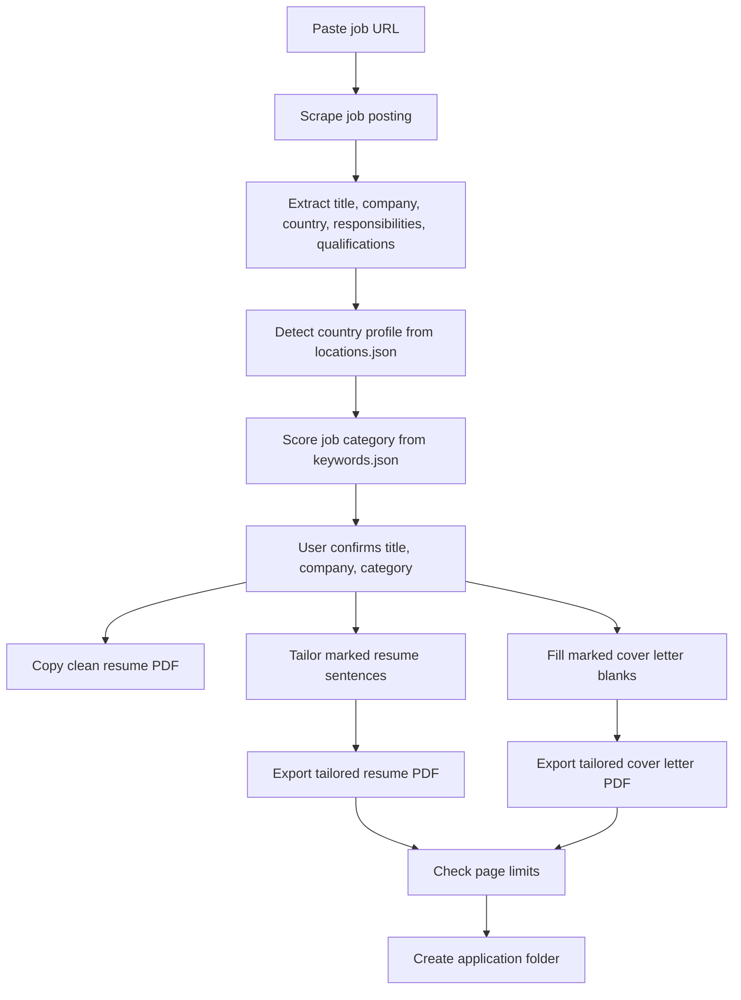
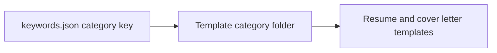
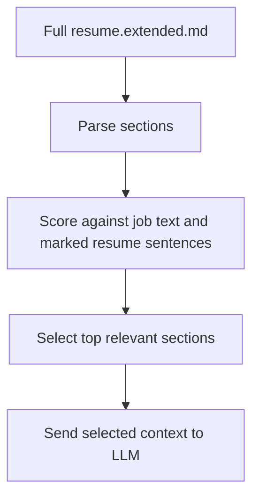
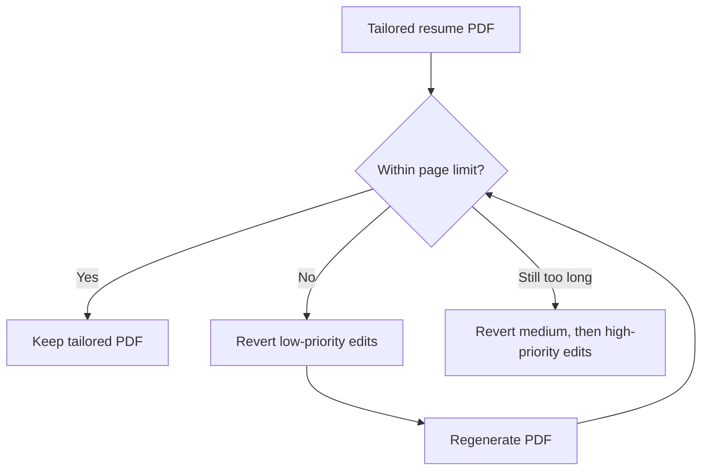
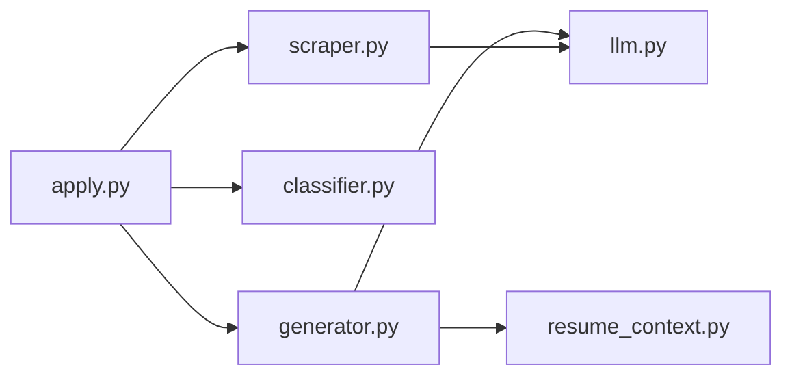

# ATSmith

ATSmith is a local Windows-first job application generator for people who already have strong resume and cover letter templates.

Paste a job URL. ATSmith creates a role-specific application folder with:

- a copied clean resume PDF
- a tailored resume PDF generated from marked resume sentences
- a tailored cover letter PDF
- a saved position description PDF
- an optional combined cover-letter bundle with recommendations, transcripts, or other PDFs

ATSmith does not generate a resume from scratch. It edits only the parts you explicitly mark, keeps factual resume content grounded in your source files, and leaves the rest of your documents alone.

## How It Works



The tool is intentionally conservative:

- Resume tailoring only touches full sentences wrapped in square brackets.
- Cover letter tailoring only touches marked blanks.
- The LLM receives factual source context and optional extended context.
- Large `resume.extended.md` files are sectioned and filtered so only relevant sections are sent to the resume prompt.
- Resume page-fit uses rollback: if the tailored resume exceeds the page limit, lower-priority resume edits are reverted first.

## Manual Sections

Use this README in order:

1. install ATSmith and configure LLM access
2. configure folders, countries, and categories
3. set up resume and cover letter templates
4. add resume source/context files
5. run ATSmith and review the generated outputs
6. use troubleshooting and developer notes when something breaks

## Requirements

ATSmith is built for this environment:

- Windows
- Python 3.10+
- Microsoft Word installed
- Microsoft Edge installed
- an LLM API key for Anthropic, OpenAI, or an OpenAI-compatible provider

PDF conversion uses Microsoft Word through `pywin32` when available, with `docx2pdf` as a fallback.

## Install

Clone or download the repository, then open PowerShell in the project folder.

```powershell
python -m venv venv
.\venv\Scripts\activate
pip install -r requirements.txt
playwright install msedge
```

Copy the local config files:

```powershell
copy .env.example .env
copy config.example.py config.py
copy keywords.example.json keywords.json
copy locations.example.json locations.json
```

These copied files are private/local and are ignored by Git.

## LLM-Assisted Setup

You can ask your preferred LLM to follow this README and configure ATSmith for you. Give it this guide, your intended folder layout, and the example config files, then ask it to produce the local `config.py`, `keywords.json`, and `locations.json` values you should use.

Do not paste API keys, private references, real resume files, or confidential personal data into an external LLM unless you are comfortable sharing them. Use placeholders first, then replace the private values locally.

Suggested prompt:

```text
Read this README and help me configure ATSmith. Ask me for the minimum folder, country, category, template filename, and LLM provider details you need. Then give me the exact values for config.py, keywords.json, and locations.json. Use placeholders for private paths and do not invent resume facts.
```

## Configure LLM Access

Open `.env` and add the API key for your provider.

Anthropic:

```env
ANTHROPIC_API_KEY=your_anthropic_api_key_here
```

OpenAI:

```env
OPENAI_API_KEY=your_openai_api_key_here
```

OpenAI-compatible endpoint:

```env
LLM_API_KEY=your_provider_api_key_here
```

Then open `config.py` and choose the provider:

```python
LLM_PROVIDER = "anthropic"            # Anthropic Claude
# LLM_PROVIDER = "openai"             # OpenAI Responses API
# LLM_PROVIDER = "openai-compatible"  # Custom OpenAI-compatible endpoint

LLM_MODEL = None                      # required for openai-compatible
LLM_BASE_URL = None                   # required only for openai-compatible
```

If you use `openai-compatible`, set `LLM_MODEL` to the provider's exact model or deployment name and set `LLM_BASE_URL`.

## Configure Folders

ATSmith needs two folder roots:

- `OUTPUT_BASE`: where generated job application folders are saved
- `TEMPLATE_BASE`: where your reusable templates live

For a simple single-market setup:

```python
OUTPUT_BASE = r"C:\ATSmith\Applications\EXL"
TEMPLATE_BASE = r"C:\ATSmith\Templates\EXL"
```

For a multi-country setup, use `PROFILES`:

```python
DEFAULT_PROFILE = "Exampleland"

PROFILES = {
    "Exampleland": {
        "OUTPUT_BASE":   r"C:\ATSmith\Applications\EXL",
        "TEMPLATE_BASE": r"C:\ATSmith\Templates\EXL",
    },
    "Freedonia": {
        "OUTPUT_BASE":   r"C:\ATSmith\Applications\FDN",
        "TEMPLATE_BASE": r"C:\ATSmith\Templates\FDN",
    },
}
```

`locations.json` must use the same country names as `PROFILES`.

Example:

```json
{
  "Exampleland": ["exampleland", "example city", "northport"],
  "Freedonia": ["freedonia", "freedonia city", "lakeside"]
}
```

When a scraped job has a recognizable country, ATSmith selects that profile automatically. If detection fails, the CLI asks you to choose.

## Configure Categories

Each top-level key in `keywords.json` must match a category folder under the selected `TEMPLATE_BASE`.

Example:

```json
{
  "_broad_categories": ["Finance", "Accounting", "Investment"],
  "Finance": ["finance analyst", "fp&a", "budgeting", "forecasting"],
  "Accounting": ["accounting", "general ledger", "reconciliation"],
  "Investment": ["valuation", "portfolio", "investment analyst"]
}
```

If your template folder is named `Fixed Income`, your `keywords.json` key must also be `Fixed Income`.



## Template Folder Layout

Your selected `TEMPLATE_BASE` should contain one folder per job category.

Single-country example:

```text
Templates/
├── Finance/
│   ├── Applicant_Resume.docx
│   ├── Applicant_Resume.pdf
│   ├── Applicant_Resume_Edit.docx
│   ├── Applicant_Cover Letter.docx
│   ├── resume.source.md
│   └── resume.extended.md
├── Accounting/
│   └── ...
└── Investment/
    └── ...
```

Multi-country example:

```text
Templates/
├── EXL/
│   ├── resume.source.md
│   ├── resume.extended.md
│   ├── Finance/
│   │   ├── Applicant_Resume.docx
│   │   ├── Applicant_Resume.pdf
│   │   ├── Applicant_Resume_Edit.docx
│   │   ├── Applicant_Cover Letter.docx
│   │   ├── resume.source.md
│   │   └── resume.extended.md
│   └── Investment/
│       └── ...
└── FDN/
    └── ...
```

In multi-country mode, each profile normally points directly to one country template root, such as `Templates\EXL`.

## Required Files Per Category

Each category folder should contain:

| File | Purpose |
| --- | --- |
| `Applicant_Resume.pdf` | Clean static resume PDF copied into the output folder first |
| `Applicant_Resume.docx` | Clean editable original for your own records |
| `Applicant_Resume_Edit.docx` | Resume template ATSmith edits |
| `Applicant_Cover Letter.docx` | Cover letter template ATSmith fills |
| `resume.source.md` | Factual source of truth for resume claims |
| `resume.extended.md` | Optional transferable/adjacent phrasing context |

The exact file names can vary if you configure these globs in `config.py`:

```python
RESUME_ORIGINAL_PDF_GLOB = "*_Resume.pdf"
RESUME_EDITABLE_DOCX_GLOB = "*_Resume_Edit.docx"
COVER_LETTER_DOCX_GLOB = "*Cover Letter.docx"
```

## Resume Marker Rules

Resume editing is narrow by design.

Only a full sentence wrapped in square brackets is editable:

```text
[Developed and maintained financial models to support budgeting cycles, rolling forecasts, and scenario analysis.]
```

ATSmith sends that sentence to the LLM without the brackets and asks for either a compact role-specific edit or a skip.

Inline markers are ignored:

```text
Developed [FILL] financial models.
```

Old command wrappers are ignored:

```text
[RESUME_BULLET: Developed financial models.]
```

Clean resume files should not contain brackets. Only the `_Edit.docx` resume should contain editable bracketed sentences.

## Resume Context Files

`resume.source.md` is the factual source of truth.

Use it for facts the resume may directly claim:

```markdown
# Resume Source

## Example Infrastructure Co

- Built a rolling budget and forecasting model for a capital-intensive operating business.
- Developed a contract-driven revenue scenario model across multiple customer groups.
```

`resume.extended.md` is optional adjacent context.

Use it for careful transferable language, not new facts:

```markdown
### FP&A, Budgeting & Forecasting

**Source basis:** Built budget and forecasting models.

**Supported transferable language:** FP&A support, rolling forecast, budget performance tracking.

**Example safe usage:** Supported FP&A planning cycles through rolling forecast models.

**Boundaries:** Do not claim budget approval authority.
```

A sanitized starter example is included at `resume.extended.example.md` in the project root. Copy it into a category folder as `resume.extended.md`, then replace the example source basis, keywords, and boundaries with your own facts.

ATSmith searches for context files in this order:

1. category folder: `TEMPLATE_BASE/<Category>/resume.source.md`
2. country/template folder: `TEMPLATE_BASE/resume.source.md`
3. project fallback: `resume.source.md` in the repository folder

The same search order applies to `resume.extended.md`.

Large `resume.extended.md` files are parsed into sections. By default, ATSmith sends only the most relevant sections to the resume prompt.



Useful settings:

```python
RESUME_EXTENDED_SELECTION_ENABLED = True
RESUME_EXTENDED_MAX_SECTIONS = 8
RESUME_EXTENDED_MAX_CHARS = 12000
RESUME_EXTENDED_MIN_SCORE = 2
```

## Resume Page Limit

The resume page limit is configurable:

```python
RESUME_PAGE_LIMIT = 1
```

If the tailored resume PDF exceeds the limit, ATSmith reverts accepted resume edits by priority:



If the resume still does not fit after all edits are reverted, ATSmith leaves the latest PDF and prints a warning.

## Cover Letter Markers

Write most of the cover letter in final wording. Mark only the parts that should change per job.

Supported markers:

| Marker | Use |
| --- | --- |
| `_` | Short fill, usually company, role, or phrase-level text |
| `[DESCRIPTION]` | Guided sentence or paragraph fill |
| `[OPTIONAL: ...]` or `OPTIONAL: ...` | Optional guided fill. If the role does not directly support it, ATSmith deletes the marked sentence. |

Example template:

```text
I am writing to express my interest in the Planning Analyst role at _.

I applied because [WHAT DRAWS YOU TO THIS COMPANY].
```

Example output:

```text
I am writing to express my interest in the Planning Analyst role at Northstar Analytics.

I applied because Northstar Analytics gives finance teams a direct role in commercial planning across complex operating units.
```

Only sentences containing a marker are sent to the LLM. Everything else in the cover letter stays untouched.

For optional sections, keep the instruction plain. Prefer `[OPTIONAL: add one sentence about relevant ERP experience if directly supported, else delete]` or `OPTIONAL: add one sentence about relevant ERP experience if directly supported, else delete` over nested placeholder wording like `[X]` and `[Y]`.

## Cover Letter Page Limit

The cover letter page limit is configurable:

```python
COVER_LETTER_PAGE_LIMIT = 1
PAGE_FIT_MAX_ATTEMPTS = 2
PAGE_FIT_MAX_LINES_PER_ATTEMPT = 4
PAGE_FIT_MIN_LINE_RETAIN_RATIO = 0.88
```

If the rendered cover letter exceeds the page limit, ATSmith asks the LLM to micro-shorten a few long lines. It rejects rewrites that cut too aggressively.

## Optional Bundle PDF

You can append recommendations, transcripts, or other PDFs after the cover letter:

```python
BUNDLE_NAME = "Cover Letter, Recommendations, Transcripts"

BUNDLE_APPENDIX = [
    r"C:\ATSmith\Documents\Recommendation.pdf",
    r"C:\ATSmith\Documents\Transcript.pdf",
]
```

Leave `BUNDLE_APPENDIX = []` if you do not want a bundle.

## Run ATSmith

From the project folder:

```powershell
.\apply.ps1
```

Or, with the virtual environment active:

```powershell
python apply.py
```

The CLI will:

1. ask for a job URL
2. scrape and extract the posting
3. detect the country profile
4. classify the category
5. show the detected title, company, and category
6. let you proceed or edit the values
7. generate the application folder

Type `q`, `quit`, `exit`, or press Enter on a blank prompt to stop.

## Example CLI Flow

```text
Paste job URL (or q to quit): https://example.com/jobs/planning-analyst

  Country:  Exampleland

  Job classified as: Finance

  Scores:
    Accounting            1  (title: 0)
    Finance               8  (title: 3) <--
    Investment            2  (title: 0)

  Title:    Planning Analyst
  Company:  Northstar Analytics
  Category: Finance

? Proceed with these? Yes

  Resume source of truth: Found
  Resume extended context: Found, selected 6/46 sections

  Resume
    Markers: 16 | Edited: 7 | Skipped: 9
    Aggression: balanced

    Edits:
      1. + rolling forecast
      4. + management reporting

  Resume PDF: C:\ATSmith\Applications\EXL\Northstar Analytics - Planning Analyst\Applicant_Resume.pdf
  Cover letter PDF: C:\ATSmith\Applications\EXL\Northstar Analytics - Planning Analyst\Applicant_Cover Letter.pdf

Done! Saved to: C:\ATSmith\Applications\EXL\Northstar Analytics - Planning Analyst
```

## Output Folder

Each job gets its own folder:

```text
OUTPUT_BASE/
└── Company - Job Title/
    ├── Applicant_Resume.pdf
    ├── Applicant_Resume_Edit.docx
    ├── Applicant_Cover Letter.docx
    ├── Applicant_Cover Letter.pdf
    ├── Position Description.pdf
    └── Cover Letter, Recommendations, Transcripts.pdf
```

The original static resume PDF is copied first. If resume markers are present, ATSmith exports the tailored resume PDF using `RESUME_TAILORED_PDF_NAME`, which defaults to the clean resume name without `_Edit`.

## Bot-Protected Pages

Some job sites block headless browsers. If ATSmith detects a blocked page, it prompts you to:

1. open the job posting in your browser
2. select all text with `Ctrl+A`
3. copy with `Ctrl+C`
4. return to the terminal and press Enter

ATSmith reads the clipboard and continues.

If structured job extraction returns malformed JSON, ATSmith asks the configured LLM to repair the JSON once. If repair still fails, it stops with a clear error instead of generating documents from empty job fields.

## Troubleshooting

### Missing Template File

Check that the selected category folder contains the required resume PDF and cover letter DOCX.

If you use custom file names, update:

```python
RESUME_ORIGINAL_PDF_GLOB
RESUME_EDITABLE_DOCX_GLOB
COVER_LETTER_DOCX_GLOB
```

### Wrong Country

Update `locations.json` so the country key matches a `PROFILES` key in `config.py`.

Example:

```json
{
  "Exampleland": ["exampleland", "example city", "northport"]
}
```

### Wrong Category

Update `keywords.json` with better title and description keywords for that category.

You can also override the detected category in the CLI before generation.

### Resume Goes Over One Page

Options:

1. lower the number of editable bracketed resume sentences
2. use shorter original resume wording
3. reduce `RESUME_EXTENDED_MAX_SECTIONS`
4. keep `RESUME_PAGE_LIMIT = 1` and let ATSmith roll back low-priority edits
5. set `RESUME_PAGE_LIMIT = 2` if your resume is intentionally two pages

### PDF Conversion Fails

Make sure:

- Microsoft Word is installed
- the DOCX file is not already open
- output folders are writable

If PDF conversion fails, ATSmith prints the warning and finishes with:

```text
Done with warnings!
```

### Bot Protection

Use the manual clipboard fallback. Copy the job page text from your browser, then return to the terminal and press Enter.

## Developer Map



Main modules:

| File | Responsibility |
| --- | --- |
| `apply.py` | CLI loop, country/profile selection, confirmation prompts |
| `scraper.py` | Playwright scraping, bot fallback, structured job extraction |
| `classifier.py` | Keyword loading and category scoring |
| `resume_context.py` | Resume source discovery and extended-context section selection |
| `generator.py` | DOCX edits, PDF export, page fitting, bundle generation |
| `llm.py` | Provider-neutral LLM calls and retry handling |
| `constants.py` | Internal tuning constants |

## Sanity Checks

If you keep tests locally, run:

```powershell
.\venv\Scripts\python.exe -m pytest tests -q -p no:cacheprovider
python -m py_compile apply.py scraper.py generator.py llm.py constants.py config.example.py classifier.py resume_context.py
git diff --check
```
